# ScheduPulse

## Introduction <a name="introduction"></a>

ScheduPulse is a web-based application designed to streamline the scheduling and management of meetings. It provides users with a user-friendly interface to create, view, edit, and delete meetings while ensuring that no overlaps occur within the same room. The platform also includes user management features, room management, and profile updates, catering to both regular users and admins.

The application ensures a smooth experience for all users, providing necessary feedback and notifications throughout the process of managing their schedules. The deployment is available on Heroku for easy access and use.

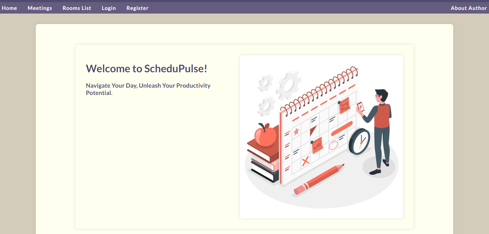

[View the deployed application here](https://schedu-pulse-9a43e3d73bd1.herokuapp.com/)

# Table of Contents 

1. [Introduction](#introduction)
2. [Design & Planning](#design-&-planning)
    * [User Stories](#user-stories)
    * [Wireframes](#wireframes)
    * [Agile Methodology](#agile-methodology)
    * [Color Palette](#color-palette)
    * [Entity Relationship Diagram](#entity-relationship-diagram)
3. [Features](#features)
    * [User Authentication & Profile Management](#user-authentication-profile-management)
    * [Meeting Management](#meeting-management)
    * [Room Management](#room-management)
    * [Admin Panel](#admin-panel)
    * [Success Messages](#success-messages)
    * [Future Implementations](#future-implementations)
4. [Technologies Used](#technologies-used)
    * [Core Development Technologies](#core-development-technologies)
    * [Libraries and Frameworks](#libraries-and-frameworks)
    * [Infrastructural Technologies](#infrastructural-technologies)
5. [Middleware and Signals](#middleware-and-signals)
6. [Testing](#testing)
    * [Manual Testing](#manual-testing)
    * [Code Validation](#code-validation)
    * [Performance Testing](#performance-testing)
7. [Bugs](#bugs)
8. [Deployment](#deployment)
9. [Credits](#credits)

## Design & Planning

### User Stories

1. **User Registration**: As a new user, I want to be able to register an account with my email and a secure password, so that I can have a personalized experience and schedule meetings.
   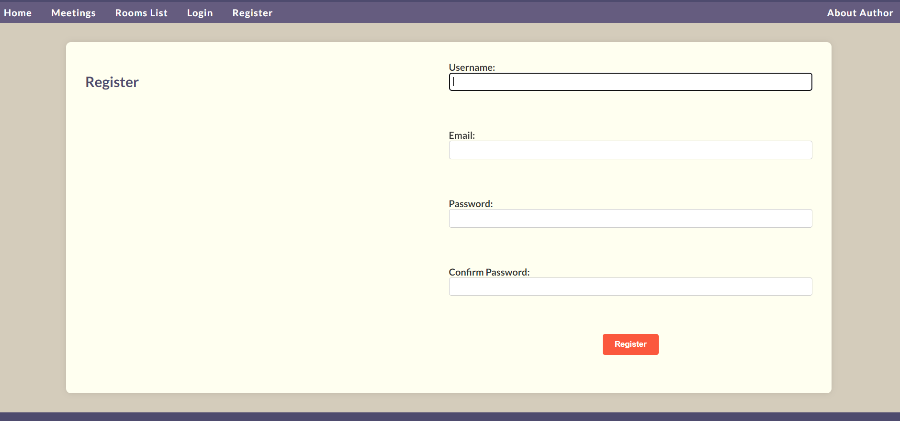
   
2. **User Login**: As a registered user, I want to log in to my account using my username and password, so that I can access and manage my meetings.
   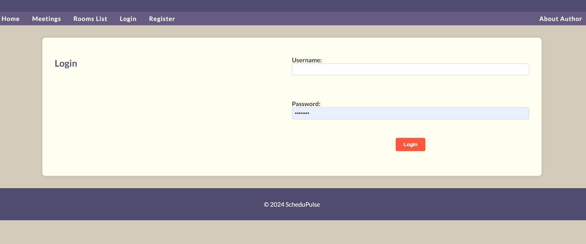
   
3. **User Logout**: As a logged-in user, I want to log out of my account, so that I can ensure my account is secure when I'm not using it.
   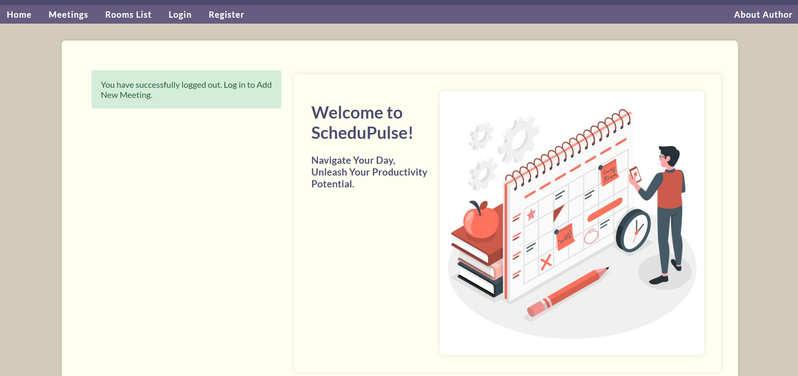
   
4. **Create New Meeting**: As a logged-in user, I want to be able to schedule a new meeting by providing the title, date, start time, duration, and room so that I can organize and plan my activities.
   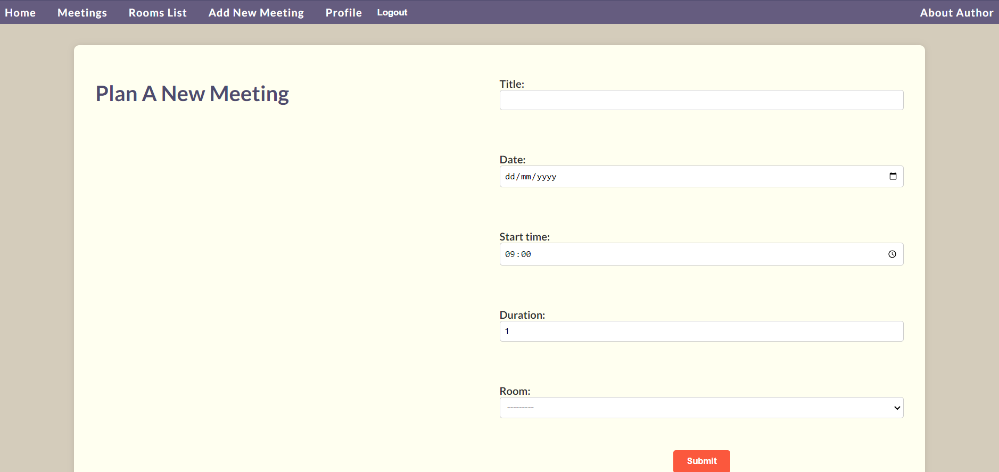
   
5. **View Meeting Details**: As a user, I want to view the details of a specific meeting so that I can see information about the meeting such as the organizer, date, time, and location.
   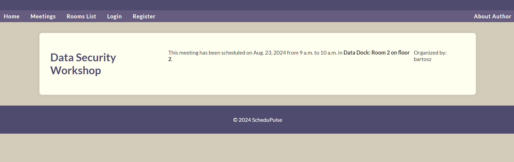
   
6. **View Rooms List**: As a user, I want to view a list of all available rooms so that I can see the rooms available for scheduling meetings.
   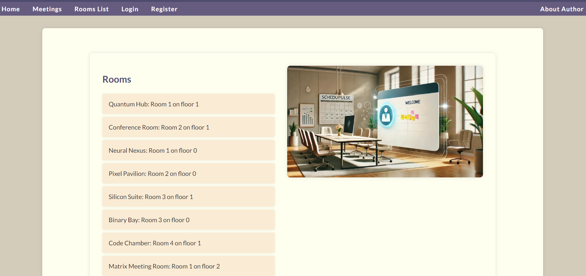
   
7. **View Profile**: As a logged-in user, I want to view my profile information so that I can see my personal details and meetings I have organized.
   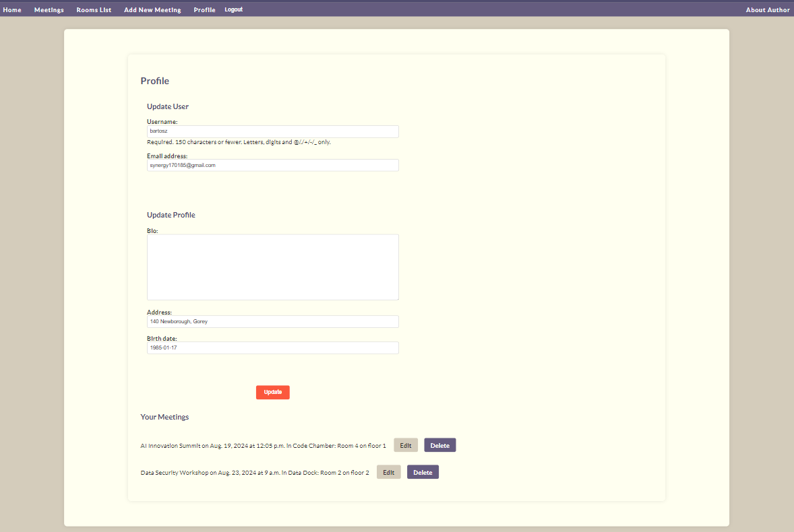
   
8. **Edit Profile**: As a logged-in user, I want to update my profile information, so that my information is current and accurate.
   
9. **Manage Meetings**: As an admin, I want to have the ability to view, edit, and delete any meeting, so that I can ensure all meetings adhere to the organization's policies and address any conflicts or issues.
   
10. **Manage Users**: As an admin, I want to view, edit, and deactivate user accounts so that I can maintain control over who can access the system and manage any inappropriate behavior.
   
11. **Create Rooms for Meetings**: As an admin, I want to be able to create new rooms by providing the room name, room number, and floor, so that I can ensure there are adequate spaces available for meetings.
   
12. **Data Validation**: As a developer, I want to ensure that data validation is in place so that invalid or harmful data cannot be submitted to the system.
   
13. **User Interface Enhancements**: As a user, I want to see clear and styled notifications for my actions so that I know the status of my operations.
   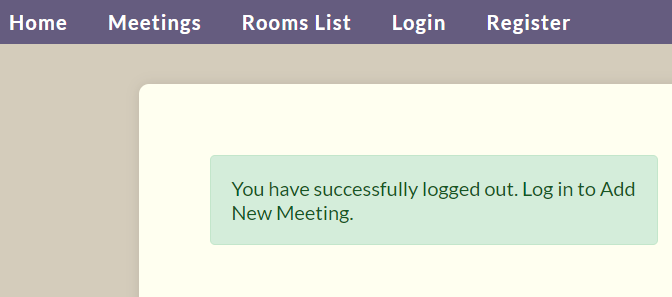
   
14. **Registration and Login Feedback**: As a user, I want to receive clear feedback when I register, log in, or log out so that I know if my actions were successful or if there were errors.
   
15. **Edit & Delete Meetings by User**: As a user, I want to edit and delete my meetings only from my profile page so that I can manage my own schedule securely.
   
16. **View Meetings from Navigation**: As a user, I want to view all meetings by clicking a "Meetings" link in the navigation bar so that I can easily access the list of meetings.
   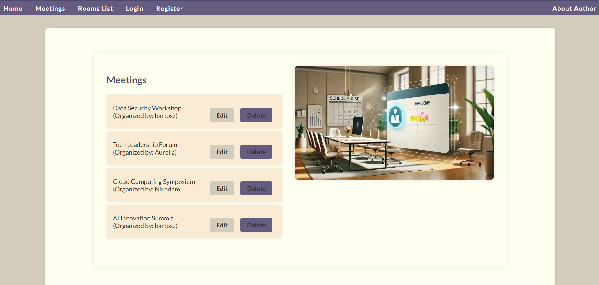
   
17. **Dynamic Validation for User Registration**: As a user, I want to receive immediate feedback on form fields while registering so that I can correct errors as I type and ensure that my registration is successful on the first try.
   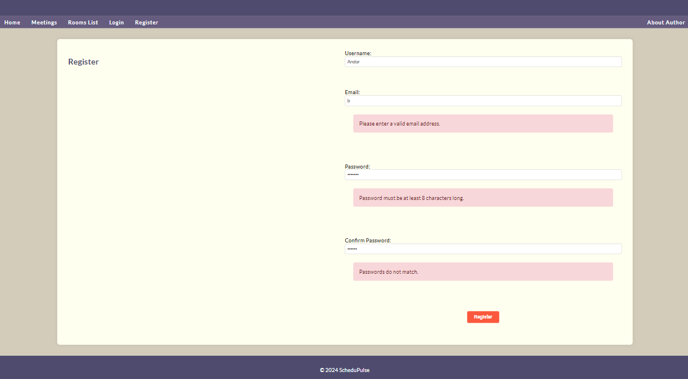
   
18. **Form Validation Tests for Meetings**: As a user, I want form validation tests for meeting creation and editing so that I can ensure the forms work correctly and handle errors appropriately.
   
19. **Access Tests for Meeting Pages**: As an authenticated user, I want tests for accessing the meeting creation and editing pages so that I can verify these pages render correctly and handle submissions appropriately.
   
20. **Access Restriction Tests for Non-Authenticated Users**: As a non-authenticated user, I want tests to restrict access to meeting creation and editing pages so that only authenticated users can manage meetings.
   
21. **Profile Update Tests**: As a user, I want tests for updating my profile information so that I can ensure profile updates are handled correctly and errors are displayed appropriately.
   
22. **Edit and Delete Meetings visible in "Meeting Page"**: As a user, I want to see the options to edit or delete meetings so that I can manage meetings effectively.

### Wireframes

Wireframes were created to visualize the structure and layout of the application. These wireframes guided the development process, ensuring a clear and intuitive user interface.

### Agile Methodology

An Agile methodology was employed in the development of ScheduPulse. User stories were prioritized and divided into sprints, with regular reviews and retrospectives to assess progress and make necessary adjustments.

### Color Palette

The color palette for ScheduPulse is designed to be professional and clean, utilizing a primary color scheme of purple and gray with accents of orange to highlight important actions and notifications.

### Entity Relationship Diagram

The ERD for ScheduPulse illustrates the relationships between key entities such as users, meetings, rooms, and profiles. This diagram guided the database design and ensured that all necessary relationships were properly implemented.

## Features

### User Authentication & Profile Management

- **User Registration and Login**: Users can create an account, log in, and log out securely. The system provides feedback on successful or failed attempts.
- **Profile Management**: Logged-in users can view and update their profile information, including bio, address, and birth date.

### Meeting Management

- **Create, View, Edit, and Delete Meetings**: Users can manage their meetings by providing details such as title, date, start time, duration, and room. The system ensures that no overlapping meetings occur within the same room.
- **Meeting List and Detail View**: Users can view a list of all meetings, with options to view detailed information about each meeting.

### Room Management

- **View Room List**: Users can view a list of available rooms, including room name, number, and floor.
- **Create New Rooms**: Admins can create new rooms to ensure that there are adequate spaces available for scheduling meetings.

### Admin Panel

- **User and Meeting Management**: Admins can view, edit, and delete any user or meeting to maintain control and ensure adherence to policies.
  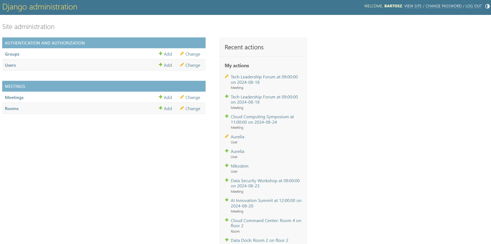
  
- **Room Management**: Admins can create and manage rooms within the system.

### Success Messages

Clear success messages are displayed to users upon completing actions such as creating, editing, or deleting meetings and updating profiles.

### Future Implementations

- **Video Uploading by Users**: Implement functionality to allow users to upload videos related to their meetings.
- **Tagging Usernames in Replies**: Enable users to tag other users by their usernames when replying to comments.
- **Reporting Comments and Users**: Introduce a reporting feature to allow users to flag inappropriate comments or user behavior.

## Technologies Used

### Core Development Technologies

- **Django**: The backend framework used to build the application.
- **HTML, CSS, JavaScript**: The front-end technologies used to build the user interface.

### Libraries and Frameworks

- **Django Forms**: Utilized for form handling and validation in both user authentication and meeting management features.
- **Whitenoise**: For serving static files in a production environment.

### Infrastructural Technologies

- **GitHub**: For version control and repository management.
- **Heroku**: For deploying and hosting the application.
- **ElephantSQL**: For managing the PostgreSQL database.

## Middleware and Signals

### Middleware

ScheduPulse utilizes a custom middleware called `EnsureProfileMiddleware` that ensures every authenticated user has an associated profile. When a user logs in for the first time, the middleware checks if the user has a profile. If not, it automatically creates one. This is essential for maintaining user-related data and ensuring that all users have a consistent experience across the platform.

### Signals

Django signals are used to automate the creation and updating of user profiles. The `post_save` signal is connected to the `User` model to trigger the creation of a `Profile` instance whenever a new user is registered. This approach ensures that every user has a profile immediately upon registration, without requiring manual intervention. Additionally, the `post_save` signal is used to update the profile whenever the user data changes, keeping the profile information in sync with the user's account data.

## Testing

### Manual Testing

Extensive manual testing was conducted to ensure that all features work as expected. This includes testing all forms, validation logic, user authentication, and meeting management functionality.

### Code Validation

All HTML, CSS, and JavaScript code was validated using appropriate tools such as W3C Validator and JSHint.  Python code was manually reviewed for adherence to PEP8 guidelines.

### Performance Testing

Performance testing was conducted using Google Lighthouse to ensure that the application performs optimally across various devices. The results show a high performance score, indicating efficient loading times and responsiveness.

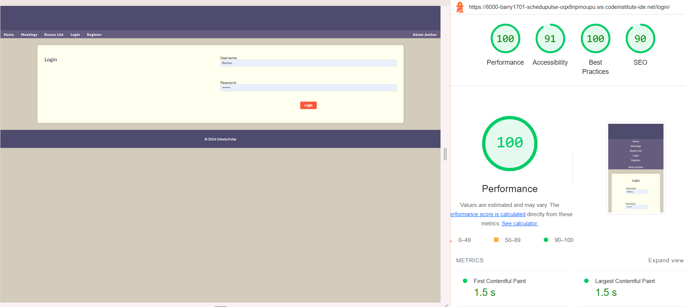

## Bugs

- **Issue**: Overlapping meetings were allowed in the same room.
- **Fix**: Added additional validation logic in the Meeting model to check for overlapping times and rooms before saving a new meeting.

- **Issue**: Static files (e.g., CSS, JavaScript) were not loading correctly in the production environment.
-  **Fix**: Configured the STATICFILES_DIRS and used Whitenoise to serve static files correctly in the Heroku deployment.


## Deployment

### Deploying to Heroku

1. **Create a GitHub Repository**: Use the Code Institute GitPod template to create a new repository.
2. **Create an App on Heroku**: Link the GitHub repository to a new Heroku app and configure environment variables.
3. **Deploy the Application**: Manually deploy the application from the Heroku dashboard.

### Fork and Clone

To fork this repository, visit the GitHub page and click "Fork". To clone, use the following command:

```bash
git clone https://github.com/yourusername/schedupulse.git
